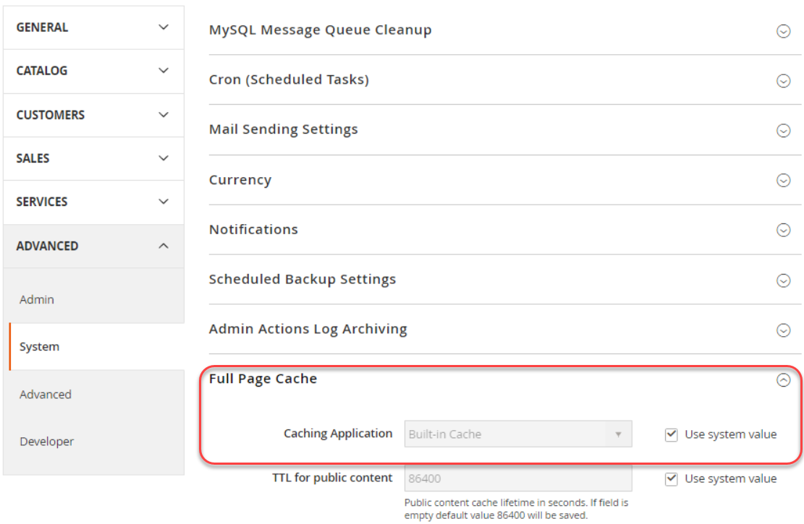

# Configuration des services Fastly

Un traitement rapide est requis pour Adobe Commerce dans les environnements d’évaluation et de production de l’infrastructure cloud.

Le service utilise rapidement Varnish pour fournir des fonctionnalités de mise en cache rapide et un réseau de diffusion de contenu (CDN) pour les ressources statiques. Fournit également un pare-feu d’applications web (WAF) pour sécuriser votre site et votre infrastructure cloud. Pour protéger votre site et votre infrastructure cloud du trafic et des attaques malveillants, acheminez tout le trafic entrant du site rapidement.

>[!NOTE]
>
>Fastly n’est pas disponible dans les environnements d’intégration.

Suivez les étapes ci-après pour activer, configurer et tester rapidement au cours du processus de développement de votre site afin d’activer un accès sécurisé à votre site.

- Obtention des informations d’identification rapides pour les environnements d’évaluation et de production
- Activation de la mise en cache rapide du réseau CDN
- Chargement rapide de fragments de code VCL
- Mise à jour de la configuration DNS pour acheminer le trafic vers le service Fastly
- Test de la mise en cache rapide

>[!NOTE]
>
>Après avoir activé et vérifié la configuration initiale de Fastly, vous pouvez personnaliser la configuration. Par exemple, vous pouvez activer des options supplémentaires telles que l’optimisation des images, les modules Edge et le code VCL personnalisé. Voir [Personnalisation de la configuration du cache](fastly-custom-cache-configuration.md).

## Obtention des informations d’identification rapides

Pendant la mise en service du projet, Adobe ajoute votre projet au [compte de service Fastly](fastly.md#fastly-service-account-and-credentials) pour Adobe Commerce sur l’infrastructure cloud et crée des informations d’identification de compte Fastly pour les environnements de démarrage `master` et d’évaluation et de production Pro. Chaque environnement dispose d’informations d’identification uniques.

Vous avez besoin des informations d’identification Fastly pour configurer des services CDN Fastly de l’administrateur et pour envoyer des demandes d’API Fastly.

>[!NOTE]
>
>Avec Adobe Commerce sur l’infrastructure cloud, vous ne pouvez pas accéder directement à l’administrateur Fastly. Utilisez l’ administrateur pour passer en revue et mettre à jour la configuration Fastly de vos environnements. Si vous ne pouvez pas résoudre un problème à l’aide des fonctionnalités Fastly dans l’Admin, envoyez un [ticket d’assistance Adobe Commerce](https://experienceleague.adobe.com/docs/commerce-knowledge-base/kb/help-center-guide/magento-help-center-user-guide.html#submit-ticket).

Utilisez les méthodes suivantes pour rechercher et enregistrer l’identifiant de service et le jeton d’API Fastly pour votre environnement :

**Pour afficher vos informations d’identification rapides** :

La méthode d’affichage des informations d’identification est différente pour les projets Pro et Starter.

- Répertoire partagé monté par IaaS : sur les projets Pro, utilisez SSH pour vous connecter à votre serveur et obtenir les informations d’identification rapides à partir du fichier `/mnt/shared/fastly_tokens.txt`. Les environnements d’évaluation et de production disposent d’informations d’identification uniques. Vous devez obtenir les informations d’identification pour chaque environnement.

- Espace de travail local : à partir de la ligne de commande, utilisez l’interface de ligne de commande `magento-cloud` pour [répertorier et revoir](../environment/variables-cloud.md#viewing-environment-variables) les variables d’environnement rapides.

  ```bash
  magento-cloud variable:get -e <environment-ID>
  ```

- [!DNL Cloud Console] : vérifiez les variables d’environnement suivantes dans la [configuration de l’environnement](../project/overview.md#configure-environment).

   - `CONFIG__DEFAULT__SYSTEM__FULL_PAGE_CACHE__FASTLY__FASTLY_API_KEY`

   - `CONFIG__DEFAULT__SYSTEM__FULL_PAGE_CACHE__FASTLY__FASTLY_SERVICE_ID`

>[!NOTE]
>
>Si vous ne trouvez pas les informations d’identification Fastly pour les environnements d’évaluation ou de production, contactez votre conseiller technique client Adobe (CTA).

## Activation de la mise en cache rapide

Vous avez besoin des composants suivants pour activer et configurer les services Fastly :

- Dernière version du [module CDN Fastly pour Magento 2](fastly.md#fastly-cdn-module-for-magento-2) installé dans les environnements d’évaluation et de production. Voir [Mise à niveau rapide](#upgrade-the-fastly-module).

- [Informations d’identification rapides](#get-fastly-credentials) pour Adobe Commerce dans les environnements d’évaluation et de production de l’infrastructure cloud

**Pour activer la mise en cache rapide du réseau de diffusion de contenu dans les environnements d’évaluation et de production** :

{{admin-login-step}}

1. Cliquez sur **Magasins** > Paramètres > **Configuration** > **Avancé** > **Système** et développez **Cache de page complet**.

   

1. Dans la section _Application de mise en cache_, supprimez la sélection de **Utiliser la valeur système**, puis sélectionnez **Fastly CDN** dans la liste déroulante.

   

1. Développez **Configuration rapide** et [choisissez les options de mise en cache](https://github.com/fastly/fastly-magento2/blob/master/Documentation/CONFIGURATION.md#configure-the-module).

1. Après avoir configuré les options de mise en cache, cliquez sur **Enregistrer la configuration** en haut de la page.

1. Effacez le cache en fonction de la notification.

1. Poursuivez la configuration Fastly en revenant à **Magasins** > **Paramètres** > **Configuration** > **Avancé** > **Système** > **Configuration Fastly**.

### Tester des informations d’identification rapides

1. Sur l’administrateur, accédez à **Magasins** > Paramètres > **Configuration** > **Avancé** > **Système** > **Configuration rapide**.

1. Si nécessaire, ajoutez les valeurs **Fastly service ID** et **Jeton API** pour votre environnement de projet.

   

   >[!NOTE]
   >
   >Ne sélectionnez pas le lien pour créer le jeton API Fastly. Utilisez plutôt les [informations d’identification rapides (ID de service et jeton API) fournies par l’Adobe](#get-fastly-credentials) fournies par l’Adobe.

1. Cliquez sur **Tester les informations d’identification**.

1. Si le test réussit, cliquez sur **Enregistrer la configuration**, puis effacez le cache.

   Si le test échoue, vérifiez que les valeurs correctes d’ID de service et de jeton d’API correspondent aux informations d’identification de l’environnement actuel.

   Si le test échoue à nouveau, envoyez un ticket d’assistance Adobe Commerce ou contactez votre représentant de compte d’Adobe. Pour les projets Pro, incluez les URL de vos sites de production et d’évaluation. Pour les projets de démarrage, incluez les URL de votre site `Master` et d’évaluation.

>[!NOTE]
>
>Pour obtenir des instructions sur la modification des informations d’identification de jeton d’API Fastly pour un environnement d’évaluation ou de production, voir [ Modifier les informations d’identification Fastly](fastly.md#change-fastly-api-token).

### Chargement rapide de VCL

Après avoir activé le module Fastly, téléchargez le [code VCL](https://github.com/fastly/fastly-magento2/tree/master/etc/vcl_snippets) par défaut sur les serveurs Fastly. Ce code fournit une série de fragments de code VCL spécifiant les paramètres de configuration pour activer la mise en cache et d’autres services CDN rapides pour votre Adobe Commerce sur l’infrastructure cloud.

>[!NOTE]
>
>Les services de mise en cache rapide ne fonctionnent pas tant que vous n’avez pas terminé le chargement initial du code VCL Fastly vers les sites d’évaluation et de production Adobe Commerce.

**Pour télécharger le fichier VCL Fastly** :

1. Dans la section _Fastly Configuration_ , cliquez sur **Télécharger VCL vers Fastly** comme le montre la figure suivante.

   

1. Une fois le transfert terminé, actualisez le cache en fonction de la notification dans la partie supérieure de la page.

## Configuration de certificats SSL/TLS

Adobe fournit un certificat SSL/TLS à validation de domaine pour diffuser rapidement le trafic HTTPS sécurisé. Adobe fournit un certificat pour chaque environnement de production, d’évaluation et de production de démarrage pour sécuriser tous les domaines de cet environnement. Pour plus d’informations sur le certificat fourni, voir [Adobe des certificats SSL (TLS) pour Adobe Commerce sur l’infrastructure cloud](https://experienceleague.adobe.com/docs/commerce-knowledge-base/kb/how-to/ssl-tls-certificates-for-magento-commerce-cloud-faq.html).

>[!NOTE]
>
>Vous pouvez fournir votre propre certificat TLS ou SSL au lieu d’utiliser le certificat Let&#39;s Encrypt fourni par Adobe. Toutefois, ce processus nécessite un travail supplémentaire pour la configuration et la maintenance. Pour choisir cette option, soumettez un ticket d’assistance Adobe Commerce ou utilisez Adobe pour ajouter des certificats personnalisés hébergés à votre Adobe Commerce dans des environnements d’infrastructure cloud.

Pour activer les certificats SSL/TLS pour les environnements Adobe Commerce, l’automatisation des Adobes effectue les étapes suivantes :

- Validation de la propriété de domaine
- dispositions d’un certificat SSL/TLS à chiffrer couvrant les sous-domaines et de niveau supérieur spécifiés pour vos magasins ;
- Télécharge le certificat dans l’environnement cloud lorsque le site est actif

Cette automatisation requiert que vous mettiez à jour la configuration DNS de votre site pour fournir des informations de validation de domaine. Utilisez **une** des méthodes suivantes :

- **Validation DNS** - Pour les sites actifs, mettez à jour votre configuration DNS avec des enregistrements CNAME qui pointent vers le service Fastly.
- **Enregistrement CNAME de défi ACME** - Mettez à jour votre configuration DNS avec des enregistrements CNAME de défi ACME fournis par Adobe pour chaque domaine de votre environnement

>[!TIP]
>
>Si vous disposez d’un domaine de production qui n’est pas actif, utilisez les enregistrements CNAME de défi ACME pour la validation de domaine. L’ajout anticipé des enregistrements à votre configuration DNS permet à l’Adobe de configurer le certificat SSL/TLS avec les domaines appropriés avant le lancement du site. Avant de passer en production, vous devez remplacer ces enregistrements d’espace réservé par les enregistrements CNAME fournis par Adobe.

Une fois la validation du domaine terminée, Adobe fournit le certificat TLS/SSL et le charge dans les environnements d’évaluation ou de production actifs. Ce processus peut prendre jusqu’à 12 heures. Nous vous recommandons d’effectuer les mises à jour de configuration DNS plusieurs jours à l’avance afin d’éviter les retards de développement et de lancement du site.

## Mise à jour de la configuration DNS avec les paramètres de développement

Lors du processus de configuration initiale rapide, vous pouvez utiliser les URL suivantes pour configurer et tester la mise en cache rapide dans les environnements d’évaluation et de production :

- Pour les environnements d’évaluation et de production Pro :

   - `mcprod.<your-domain>.com`
   - `mcstaging.<your-domain>.com`

- Pour la production de démarrage uniquement :

   - `mcprod.<your-domain>.com`

Ces URL de préproduction par défaut sont disponibles une fois votre projet configuré. La valeur de `"your-domain"` est le nom de domaine que vous avez spécifié pendant le processus d’intégration.

>[!NOTE]
>
>Vous ne pouvez pas spécifier de domaine personnalisé pour un environnement hors production sur les projets de démarrage.

Pour acheminer le trafic de vos URL de magasin vers le service Fastly, mettez à jour votre configuration DNS. Lorsque vous mettez à jour la configuration, Adobe fournit automatiquement les certificats SSL/TLS requis et les télécharge vers vos environnements cloud. Cette mise en service peut prendre jusqu’à 12 heures.

>[!NOTE]
>
>Lorsque vous êtes prêt à lancer votre site de production, vous devez à nouveau mettre à jour la configuration DNS pour diriger vos domaines de production vers le service Fastly et effectuer d’autres tâches de configuration. Voir [Liste de contrôle de Launch](../launch/checklist.md).

**Conditions préalables :**

- Activez le module Fastly.
- Téléchargez le code VCL Fastly par défaut.
- Fournissez une liste des sous-domaines et de niveau supérieur pour chaque environnement à Adobe ou envoyez un ticket d’assistance Adobe Commerce.
- Attendez la confirmation que les domaines spécifiés ont été ajoutés à vos environnements cloud.
- Sur les projets de démarrage, ajoutez les domaines à votre configuration de service Fastly. Voir [Gestion des domaines](fastly-custom-cache-configuration.md#manage-domains).
- Pour plus d’informations sur la mise à jour de la configuration DNS, vérifiez auprès de votre [serveur d’inscriptions DNS](https://lookup.icann.org/) la méthode correcte pour votre service de domaine.

**Pour mettre à jour votre configuration DNS pour le développement** :

1. Pointez les URL de pré-production vers le service Fastly en ajoutant des enregistrements CNAME : `prod.magentocloud.map.fastly.net`, par exemple :

   | Domaine ou sous-domaine | CNAME |
   |---------------------------|----------------------------------|
   | mcprod.your-domain.com | prod.magentocloud.map.fastly.net |
   | mcstaging.your-domain.com | prod.magentocloud.map.fastly.net |

   Lorsque les enregistrements CNAME sont actifs, Adobe fournit les certificats et télécharge les certificats SSL/TLS.

   >[!NOTE]
   >
   >Si vous prévoyez d’utiliser des domaines apex (`your-domain.com`) pour votre site de production, vous devez configurer les enregistrements d’adresses DNS (enregistrements A) pour qu’ils pointent vers les adresses IP du serveur Fastly. Voir [ Mise à jour de la configuration DNS avec les paramètres de production ](../launch/checklist.md#to-update-dns-configuration-for-site-launch).


1. Ajoutez des enregistrements CNAME de défi ACME pour la validation de domaine et la préconfiguration des certificats SSL/TLS de production, par exemple :

   | Domaine ou sous-domaine | CNAME |
   |-------------------------------------------|-------------------------------------------|
   | _acme-challenge.your-domain.com | 0123456789abcdef.validation.magento.cloud |
   | _acme-challenge.www.your-domain.com | 9573186429stuvwx.validation.magento.com |
   | _acme-challenge.mystore.your-domain.com | 1234567898zxywvu.validation.magento.cloud |
   | _acme-challenge.subdomain.your-domain.com | 1098765743lmnopq.validation.magento.cloud |

   >[!NOTE]
   >
   >Les enregistrements de défi ACME dans cet exemple sont des espaces réservés qui ne sont pas destinés à approvisionner vos sites d’évaluation et de production Adobe Commerce. Obtenez les informations d’enregistrement de défi ACME correctes pour votre projet en contactant l’Adobe.

   Après avoir ajouté les enregistrements CNAME, Adobe valide les domaines et fournit le certificat SSL/TLS pour l’environnement. Lorsque vous mettez à jour la configuration DNS pour acheminer le trafic de ces domaines vers le service Fastly, Adobe télécharge le certificat vers l’environnement.

1. Mettez à jour l’URL de base Adobe Commerce.

   - Utilisez SSH pour vous connecter à l’environnement de production.

     ```bash
     magento-cloud ssh
     ```

   - Utilisez l’interface de ligne de commande de Cloud pour modifier l’URL de base de votre boutique.

     ```bash
     php bin/magento setup:store-config:set --base-url="https://mcstaging.your-domain.com/"
     ```

   >[!NOTE]
   >
   >Au lieu d’utiliser l’interface de ligne de commande de Cloud, vous pouvez mettre à jour l’URL de base à partir de l’[Admin](https://experienceleague.adobe.com/docs/commerce-admin/stores-sales/site-store/store-urls.html)

1. Redémarrez le navigateur web.

1. Testez votre site web.

## Test de la mise en cache rapide

Une fois les modifications de configuration DNS effectuées, utilisez l’outil de ligne de commande [cURL](https://curl.se/) pour vérifier que le cache Fastly fonctionne.

**Pour vérifier les en-têtes de réponse** :

1. Dans un terminal, utilisez la commande `curl` suivante pour tester l’URL de votre site actif :

   ```bash
   curl -vo /dev/null -H Fastly-Debug:1 https://<live-URL>
   ```

   Si vous n’avez pas défini d’itinéraire statique ou terminé la configuration DNS pour les domaines de votre site en direct, utilisez l’indicateur `--resolve`, qui contourne la résolution du nom DNS.

   ```bash
   curl -vo /dev/null -H Fastly-Debug:1 --resolve <live-URL-hostname>:443:<live-IP-address>
   ```

1. Dans la réponse, vérifiez les [en-têtes](fastly-troubleshooting.md#check-cache-hit-and-miss-response-headers) pour vous assurer que Fastly fonctionne. Vous devriez voir les en-têtes uniques suivants dans la réponse :

   ```http
   < Fastly-Magento-VCL-Uploaded: yes
   < X-Cache: HIT, MISS
   ```

Si les en-têtes ne comportent pas les valeurs correctes, reportez-vous à la section [Résoudre les erreurs détectées dans les en-têtes de réponse](fastly-troubleshooting.md#curl) pour obtenir de l’aide sur la résolution des problèmes.

## Mettre à niveau le module Fastly

Met à jour rapidement le CDN Fastly pour le module Magento 2 afin de résoudre les problèmes, d’améliorer les performances et de fournir de nouvelles fonctionnalités.
Nous vous recommandons de mettre à jour le module Fastly dans vos environnements d’évaluation et de production vers la [dernière version](https://github.com/fastly/fastly-magento2/blob/master/VERSION).

Après avoir mis à jour le module, vous devez télécharger le code VCL pour appliquer les modifications à la configuration de service Fastly.

>[!WARNING]
>
> Si vous avez personnalisé le code VCL Fastly par défaut avec une version personnalisée, la mise à niveau du module Fastly remplace vos modifications. Si vous avez ajouté des fragments de code VCL personnalisés avec des noms uniques, ces modifications sont conservées pendant le processus de mise à niveau. Il est recommandé de mettre à niveau l’environnement d’évaluation et de valider les modifications avant d’appliquer les modifications à l’environnement de production.

**Pour vérifier la version du module CDN Fastly pour Magento 2** :

1. Accédez au répertoire racine de votre environnement cloud.

1. Utilisez le compositeur pour vérifier la version installée.

   ```bash
   composer show *fastly*
   ```

1. Si la [dernière version](https://github.com/fastly/fastly-magento2/releases) n’est pas installée, exécutez les étapes de mise à niveau du module Fastly.

**Pour mettre à niveau le module Fastly** :

1. Dans votre environnement d&#39;intégration locale, utilisez les informations de module suivantes pour [mettre à niveau le module Fastly](../store/extensions.md#upgrade-an-extension).

   ```text
   module name: fastly/magento2
   repository: https://github.com/fastly/fastly-magento2.git
   ```

1. Poussez vos mises à jour dans l’environnement d’évaluation.

1. Connectez-vous à l’administrateur de votre environnement d’évaluation pour [télécharger le code VCL](#upload-vcl-to-fastly).

1. [ Vérifiez les services rapides ](fastly-troubleshooting.md#verify-or-debug-fastly-services) sur le site d’évaluation Adobe Commerce.

Après avoir vérifié les services rapides sur le site d’évaluation, répétez le processus de mise à niveau dans l’environnement de production.

>[!TIP]
>
> Si vous rencontrez des problèmes avec les services Fastly dans vos environnements Adobe Commerce, reportez-vous à l’ [outil de dépannage Fastly d’Adobe Commerce](https://experienceleague.adobe.com/docs/commerce-knowledge-base/kb/troubleshooting/miscellaneous/magento-fastly-troubleshooter.html).
